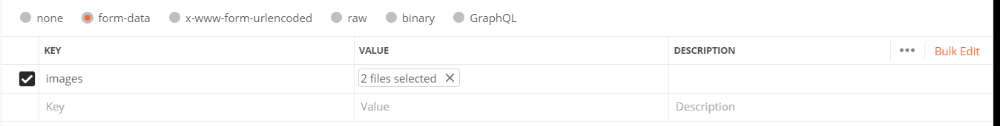
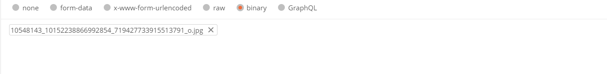

# Node.js Express Image Utility Server
## Project description
The project provides image utility functions which currently include<br>
- generate an image thumbnail<br>
- convert an image to ASCII representative<br>
- cartoonize an image<br>
## Project setup
```
To install: npm install
To run: node server.js
```


## APIs
```
POST /image/asciify[?width=80]  - asciify the uploaded image
POST /image/thumbnail[?percentage=10] - thumbnailize the uploaded image 
POST /image/cartoon - cartoonize the uploaded image
```

## .env
Configurations are reading from local .env file which contains environment variables<br>
IMGUTIL_PORT specifies port number to be listened on, default is 80 if not specified<br>
IMGUTIL_MAX_IMG_SIZE specifies maximum image size allowed, default is 10m is not specified<br>
IMGUTIL_DEEPAI_API_KEY, you need to apply for a free api key from [Deepai](https://deepai.org), in order to use cartoon function<br>
<br>


##  Upload images from Postman
### form-data type body
In Postman, create a new post request to the route /images; click on the "form-data", then add "images" as a key and you will see a hidden drop-down at the right of the key field which says Text as default,  change the type from text to file and choose one or multiple image files to upload.<br>
<br><br><br>
### binary type body
Binary is designed to send the information in a format that cannot be entered manually, to use this option, create a new post request to the route /images/:name (here name is the image file name);  click on the "binary", a "CHOOSE FILES" option will be available, click it to select an image file to upload.<br>
Please note image name must be specified in the route<br>
<br><br><br>

## References
[1] [How to upload files in Node.js and Express](https://attacomsian.com/blog/uploading-files-nodejs-express)<br>
[2] [Express File Upload with Multer in Node.js](https://attacomsian.com/blog/express-file-upload-multer)<br>
[3] [Generate an image thumbnail](https://github.com/onildoaguiar/image-thumbnail)<br>
[4] [Grab all the pixels in an image and return the result as an ndarray](https://www.npmjs.com/package/get-pixels)<br>
[5] [Deepai](https://deepai.org)<br>
[6] [How to deploy a node.js application on aws ec2 server](https://ourcodeworld.com/articles/read/977/how-to-deploy-a-node-js-application-on-aws-ec2-server)<br>
[7] [AWS npm install failed](https://stackoverflow.com/questions/54096891/npm-install-fails-on-ubuntu-18-04-with-error-failed-at-the-bcrypt3-0-3-insta)